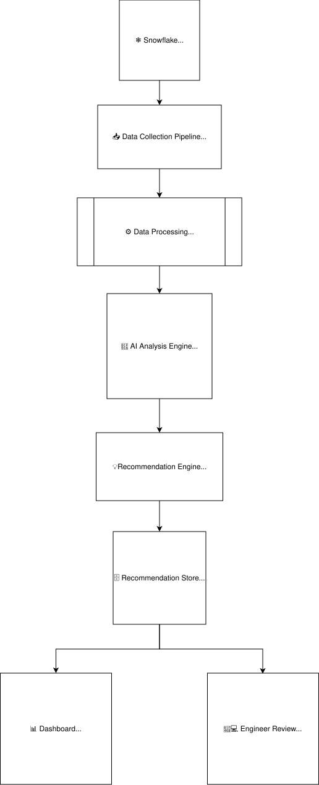

# Snowflake Cost Intelligence Platform
<p align="center">
  
</p>
> An internal engineering platform built to replace SELECT.dev by providing AI-assisted Snowflake cost analysis, query optimization, and warehouse intelligence.

---

| **Role** | Data Engineer |
|----------|---------------|
| **Project Type** | Internal Engineering Platform |
| **Status** | Production |
| **Tech Stack** | Python · Snowflake · OpenAI API · OAuth |

## 📄 Executive Summary

When SELECT.dev was removed from our Snowflake agreement, the engineering team needed an internal alternative to continue monitoring warehouse costs and identifying inefficient query patterns.

Rather than replicating the existing product, I designed and developed an internal platform that combined Snowflake query analytics with AI-powered optimization recommendations. The platform provided engineers with cost visibility, highlighted expensive queries, and suggested optimized SQL, while allowing teams to track whether recommendations had already been reviewed or acted upon.

---

## 🎯 Business Problem

The existing commercial solution provided valuable visibility into Snowflake warehouse costs and query performance. However, after licensing changes, continuing to use the platform incurred additional costs.

The objective was to build an internal solution that could:

- Provide warehouse-level cost visibility.
- Identify expensive and inefficient queries.
- Recommend SQL optimizations using AI.
- Track recommendation status to avoid repeated analysis.
- Reduce dependency on third-party tooling.

---

## 🏗️ Solution Architecture

The platform follows a modular architecture that separates data collection, processing, AI-assisted analysis, recommendation management, and user interaction. This separation allows each component to evolve independently while maintaining a reliable and scalable workflow.

<p align="center">
  
</p>

**High-Level Flow**

1. Snowflake query history and warehouse usage data are collected through a scheduled Python pipeline.
2. Query metadata is processed to identify high-cost or inefficient workloads.
3. The AI Analysis Engine evaluates candidate queries and provides optimization insights.
4. The Recommendation Engine converts those insights into actionable recommendations.
5. Recommendations are stored centrally and surfaced through the dashboard for engineering review.
6. Engineers review, validate, and manage recommendations through a structured workflow.

---

## ⚙️ System Workflow

The platform operates as a daily scheduled workflow.

1. A scheduled Python job authenticates with Snowflake using OAuth.
2. Query execution history and warehouse usage metrics are collected.
3. Processed metadata is stored back into Snowflake.
4. Expensive or inefficient queries are identified.
5. Query details are sent to the OpenAI API.
6. AI-generated optimization recommendations are produced.
7. Engineers review recommendations through the dashboard and mark them as:
   - Pending
   - Reviewed
   - Optimized
   - Keep As Is
   - Ignored
8. Reviewed recommendations are excluded from future analysis unless new execution patterns are detected.

### Recommendation Lifecycle

Each AI-generated recommendation progressed through a review workflow before being considered complete.

```text
Pending
    │
    ▼
Reviewed
    │
    ▼
Optimized
    │
    ├── Keep As Is
    └── Ignored
```

Once a recommendation was reviewed, its status was persisted in the Recommendation Store to prevent it from being surfaced repeatedly during subsequent analyses.

---

## ✨ Key Features

### 📊 Cost Intelligence

- Daily warehouse cost analysis
- Query-level execution insights
- Historical cost visibility

### 🤖 AI-assisted Query Optimization

- Automatic identification of expensive queries
- AI-generated SQL optimization suggestions
- Actionable engineering recommendations

### 📋 Recommendation Lifecycle

Recommendations move through a review workflow:

- Pending
- Reviewed
- Optimized
- Keep As Is
- Ignored

This prevents duplicate recommendations and helps engineering teams focus only on unresolved optimization opportunities.

---

## 🛠️ Technologies Used

| Category | Technology |
|----------|------------|
| Language | Python |
| UI | Streamlit |
| Data Platform | Snowflake |
| Authentication | OAuth |
| AI | OpenAI API |
| Scheduling | Cron |
| Storage | Snowflake |

---

## 📈 Scale

Although built as an internal engineering platform, the solution was designed to support production-scale analytics.

| Metric | Approximate Scale |
|---------|------------------:|
| Snowflake Warehouses | ~20 |
| Internal Users | ~300 |
| Query Analysis | Daily |
| Initial Optimization Recommendations | ~50 |

---

## 🚀 Impact

The Snowflake Cost Intelligence Platform successfully replaced the need for a commercial query analysis tool while introducing capabilities that were previously unavailable.

### Business Impact

- Eliminated dependency on a third-party Snowflake cost analysis platform.
- Enabled engineering teams to continue monitoring warehouse costs without additional licensing costs.
- Centralized query performance insights into a single internal dashboard.

### Engineering Impact

- Automated daily analysis of Snowflake query workloads.
- Reduced manual effort required to identify expensive or inefficient SQL queries.
- Introduced AI-assisted SQL optimization recommendations into the engineering workflow.
- Implemented a recommendation lifecycle to prevent duplicate reviews and improve team collaboration.

### Platform Adoption

The platform was designed to support approximately:

- ~20 Snowflake warehouses
- ~300 internal users
- Daily automated workload analysis
- Initial rollout with ~50 optimization recommendations

---

## 📚 Lessons Learned

Building an internal engineering platform involved much more than replacing an existing commercial tool. The challenge was to create a solution that engineers could trust and integrate into their daily workflow.

The most valuable lesson was that identifying expensive queries alone was insufficient. The platform needed to generate actionable recommendations while providing a structured workflow to track which optimizations had already been reviewed and implemented.

---

## 🔮 Future Improvements

Potential enhancements include:

- Historical comparison of query optimizations.
- Warehouse-level optimization dashboards.
- Feedback loops to improve future AI recommendations.